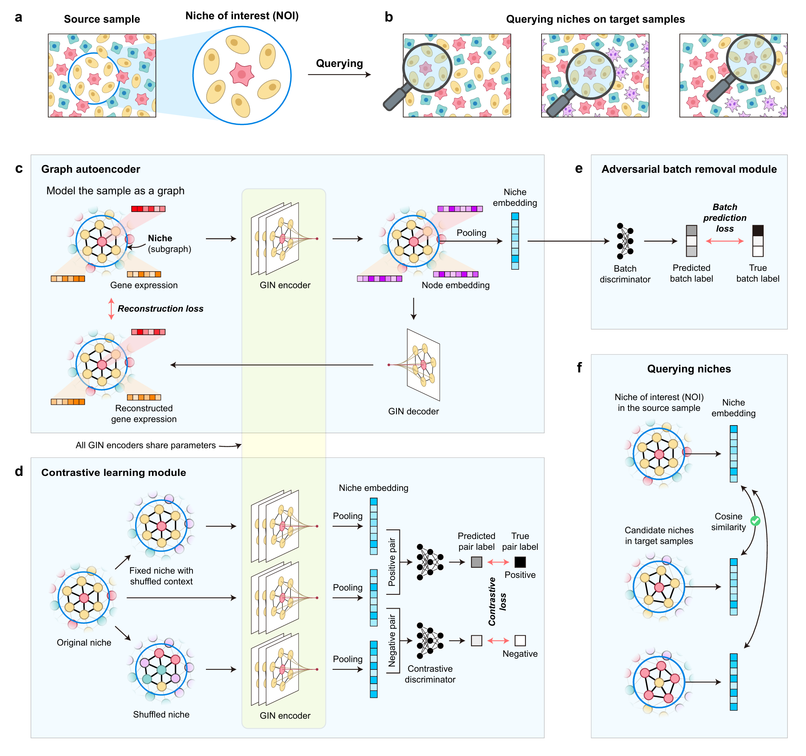

# Querying functional and structural niches on spatial transcriptomics data

## Overview

Cells in multicellular organisms coordinate to form functional and structural niches. With spatial transcriptomics enabling gene expression profiling in spatial contexts, it has been revealed that spatial niches serve as cohesive and recurrent units in physiological and pathological processes. These observations suggest universal tissue organization principles encoded by conserved niche patterns, and call for a query-based niche analytical paradigm beyond current computational tools. In this work, we defined the Niche Query Task, which is to identify similar niches across ST samples given a niche of interest (NOI). We further developed QueST, a specialized method for solving this task. QueST models each niche as a subgraph, uses contrastive learning to learn discriminative niche embeddings, and incorporates adversarial training to mitigate batch effects. In simulations and benchmark datasets, QueST outperformed existing methods repurposed for niche querying, accurately capturing niche structures in heterogeneous environments and demonstrating strong generalizability across diverse sequencing platforms. Applied to tertiary lymphoid structures in renal and lung cancers, QueST revealed functionally distinct niches associated with patient prognosis and uncovered conserved and divergent spatial architectures across cancer types. These results demonstrate that QueST enables systematic, quantitative profiling of spatial niches across samples, providing a powerful tool to dissect spatial tissue architecture in health and disease.

<div align="center">
    <figure>
        
        <!-- <figcaption>QueST Model Architecture</figcaption> -->
    </figure>
</div>


## Getting started

### Installation

We recommend using a conda environment

```bash
conda create -n quest python==3.9.19
```

Install necessary dependencies first before the installation of QueST

```bash
conda activate quest
pip install -r requirements.txt
```

Finally, QueST is available on PyPI and can be installed via 

```bash
pip install quest-niche
```

### Usage

See detailed usage on [Read the Docs](https://quest-niche.readthedocs.io/en/latest/index.html) website.

## Data Availability

- For complete reference datasets and pretrained model weights, please refer to https://drive.google.com/drive/folders/1kQqReo7Groy4WMDjT2JNHzN6tXPSHrtf?usp=sharing
