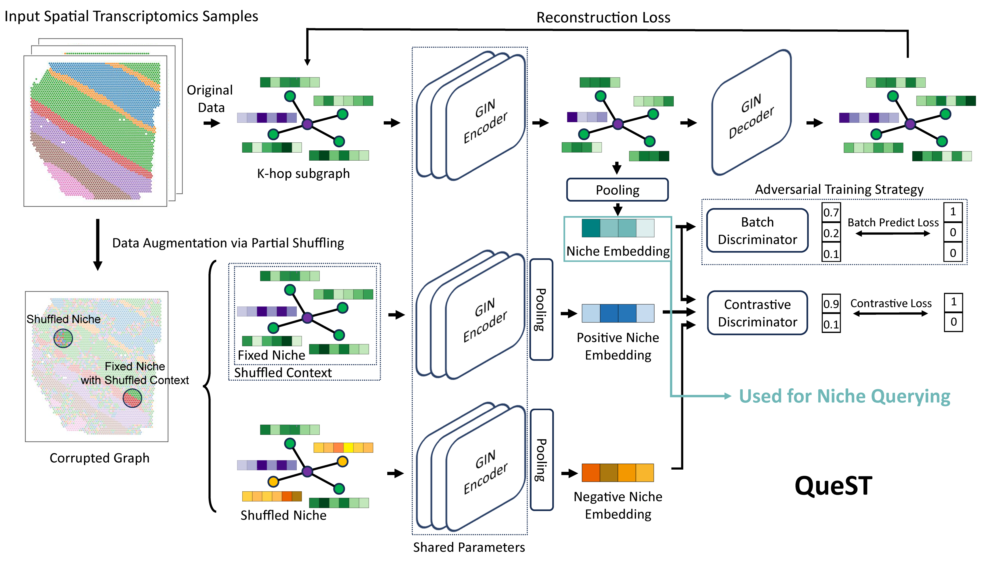

# QueST: Querying Functional and Structural Niches on Spatial Transcriptomics Data

## Overview

Cells in multicellular organisms coordinate within tissues to form spatial niches. While spatial transcriptomics enables gene expression profiling in spatial contexts, most existing methods remain cell-centric and fail to model niches as integrated analytical units. In this work, we defined the task of spatial niche querying, which aims to identify niches with similar structural or functional characteristics across samples, and developed QueST, a framework tailored for the niche query task. QueST models each niche as a subgraph, utilizes subgraph contrastive learning to learn discriminative niche embeddings, and incorporates adversarial training to mitigate batch effects. Experiments showed that QueST accurately captured niche structure under heterogeneous environments on a simulation dataset, greatly outperformed state-of-the-art methods on systematic benchmarks, and generalized across sequencing platforms. Application to tertiary lymphoid structures in renal and lung cancer revealed both shared and distinct niche patterns, demonstrating QueST’s ability to uncover biologically meaningful spatial organization. In summary, QueST provides a powerful framework for cross-sample niche comparison, facilitating deeper insights into the structural logic of tissue organization in health and disease.

<div align="center">
    <figure>
        
        <!-- <figcaption>QueST Model Architecture</figcaption> -->
    </figure>
</div>


## Getting started

### Dependencies

```
python                   3.9.19
numpy                    1.23.4
scanpy                   1.9.8
squidpy                  1.4.1
anndata                  0.10.6
scikit-learn             1.4.1
networkx                 3.2.1
torch                    2.2.1
torch-geometric          2.5.2
torch-scatter            2.1.2
torch-sparse             0.6.18
torch-spline-conv        1.2.2
graphcompass             0.2.2
```

### Installation via PyPI

QueST is available on PyPI and can be installed via 

```
pip install quest-niche
```

### Usage

See detailed usage on [Read the Docs](https://quest-niche.readthedocs.io/en/latest/index.html) website.

## Data Availability

- For complete reference datasets and pretrained model weights, please refer to https://drive.google.com/drive/folders/1kQqReo7Groy4WMDjT2JNHzN6tXPSHrtf?usp=sharing
